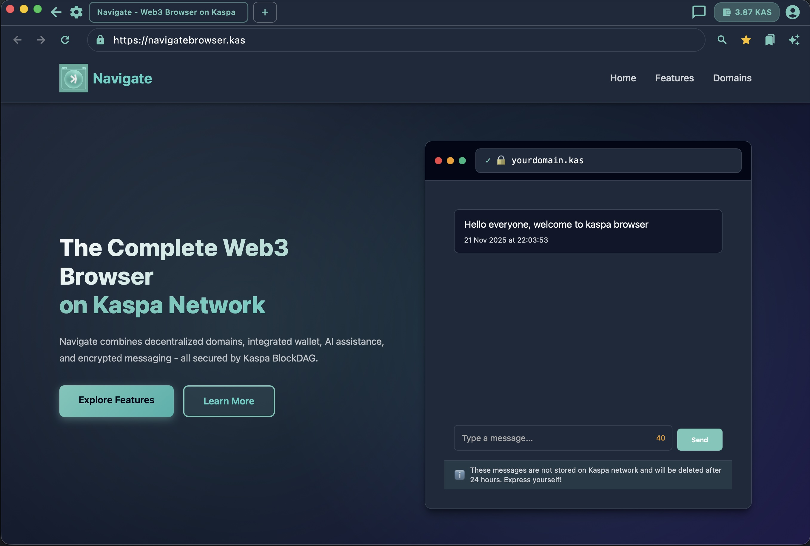

# Navigate - Blockchain-Powered Browser for Kaspa

> **⚠️ SECURITY WARNING: PROOF OF CONCEPT RELEASE**
>
> This release is a **Proof of Concept (PoC)** intended **exclusively for advanced technical users** for the purpose of security checks, code audits, and testing.
>
> - **DO NOT USE WALLETS WITH REAL FUNDS.**
> - Please conduct a thorough security audit of the code before running it.
> - This software is provided "as is" for testing and improvement purposes only.

Navigate is the all-in-one Web3 browser built on the **Kaspa** BlockDAG, designed to provide everything you need for the decentralized web.



### 🌐 Domain Setup Guide

To make your own `.kas` domain accessible in Navigate, follow these steps:

1.  **Inscribe your domain:**
    Go to [KNS App](https://app.knsdomains.org/) and inscribe your desired domain name.

2.  **Setup a server:**
    Get a dedicated server, cloud server, or set up your own server and note its IP address.

3.  **Inscribe DNS Record:**
    In [KNS App](https://app.knsdomains.org/), inscribe a DNS record linking your domain to your IP:
    ```json
    {"d":"yourdomain","ip":"YOUR_IP"}
    ```
    > **Important:** Do NOT add `.kas` to the domain name in the JSON.

4.  **Generate Self-Signed Certificate:**
    Use the provided script to generate a minimal self-signed certificate:
    ```bash
    ./generate_certificate.sh --domain=yourdomain.kas
    ```
    This will output: `cert.der`, `cert.pem`, `key.pem`, and `certificate.json`.

5.  **Inscribe Certificate Record:**
    Take the content of `certificate.json` and inscribe it on [KNS App](https://app.knsdomains.org/):
    ```json
    {"d":"yourdomain","c":"YOUR_CERTIFICATE_BASE64"}
    ```
    > **Important:** Do NOT add `.kas` to the domain name in the JSON.

6.  **Deploy Web Application:**
    Configure your web server (e.g., Nginx, Apache) to use the generated `cert.pem` and `key.pem` for HTTPS.

7.  **Browse:**
    Open Navigate Browser and visit your site: `https://yourdomain.kas`

### 🧪 Demo
Currently only one real domain associated to a server is available at **https://navigatebrowser.kas** for demo purpose:
[View Domain Asset](https://app.knsdomains.org/asset/1b2f459cdb46b6ea4c38f8931967af4cc62a384db378d03462a06f7e37ff0a14i0)

**DNS Record on chain:**
```json
{"d":"navigatebrowser","ip":"51.158.152.51"}
```
[View DNS Asset](https://app.knsdomains.org/asset/99c2fc618edb1c9436f579db22e76be50a53ae306225eb68af6819fc04446b33i0)

**Certificate Record:**
```json
{"d":"navigatebrowser","c":"MIIBRTCB7KADAgECAgEBMAoGCCqGSM49BAMCMBoxGDAWBgNVBAMMD25hdmlnYXRlYnJvd3NlcjAgFw0yNTExMjAxODU2MTFaGA8yMDUzMDQwNjE4NTYxMVowGjEYMBYGA1UEAwwPbmF2aWdhdGVicm93c2VyMFkwEwYHKoZIzj0CAQYIKoZIzj0DAQcDQgAEylGmaXwcJnbPSDX/JcuAaSh8lx50jyEZQ/JrbQWmYyRw+Mg4oI+DtegKtVw+P7UyTnEUT1NAbCj5NZBHYoxDsaMhMB8wHQYDVR0OBBYEFH1HpcfcRk6EovnA0tcptSlhZgNYMAoGCCqGSM49BAMCA0gAMEUCIQCQibH3ri8lio8K0Ug7ymNb3LZrWBvfsTHiNa5+OSU4/gIgJ8qKv+FQyVq4g+iK5nKQEQj143w1Ik2I4/xSHOoyzYo="}
```
[View Certificate Asset](https://app.knsdomains.org/asset/be8d754483a23ee4d77b853a2f9129459def40318f33637217d498cecb19be52i0)

### Everything You Need for Web3

- **🌐 Decentralized Domains:** Own `.kas` domains with cryptographic security. Create, manage, and verify domains on the Kaspa BlockDAG with complete ownership.
- **💼 Integrated Wallet:** Native Kaspa wallet with multi-wallet support, secure key management, and real-time balance tracking. Your keys, your control.
- **🤖 AI Assistant:** Context-aware AI that helps you browse smarter. Ask questions about pages, get insights, and customize your AI experience.
- **💬 Encrypted Messaging:** Secure peer-to-peer chat between Kaspa addresses. Contact management, message encryption, and BlockDAG-based delivery.
- **🛡️ Security First:** BlockDAG-based certificate pinning eliminates MITM attacks. Three-layer anti-hijacking protection ensures only legitimate DNS and certificate records are used.
- **⚡ Lightning Fast:** Built on Kaspa's DAG architecture for instant domain resolution. Multi-tab browsing, bookmarks, and smooth performance.

---

## 🚀 Key Features

### 🌐 Decentralized Domain Resolution (KNS)
- **Native .kas Support:** Seamlessly resolves `.kas` domains (e.g., `navigate.kas`) to IP addresses using the KNS API.
- **Blockchain Verification:** Every domain resolution is verified against the Kaspa blockchain to ensure ownership and authenticity.
- **Asset Parsing:** Automatically parses KNS assets to find DNS records (`{"d": "domain", "ip": "..."}`) and Certificate data.

### 🔒 Blockchain-Based Certificate Pinning
- **Root of Trust:** The blockchain serves as the source of truth for SSL/TLS certificates.
- **Strict Validation:** The browser strictly pins the server's certificate against the one stored in the KNS record.
- **Native Security:** Utilizes native iOS/macOS security frameworks (`SecTrust`, `Security.framework`) via a custom Swift plugin for robust certificate validation.
- **MITM Protection:** Connections are immediately terminated if the server's certificate does not match the blockchain record.

### 💼 Integrated Kaspa Wallet
- **Non-Custodial:** Full control over your private keys and funds.
- **Mnemonic Support:** Create or import wallets using standard 12 or 24-word seed phrases.
- **Real-Time Balance:** View your Kaspa (KAS) balance directly in the browser toolbar.
- **Secure Storage:** Sensitive data like seed phrases and private keys are encrypted using secure storage mechanisms.

### 🤖 AI Assistant
- **Context-Aware:** Built-in AI assistant to help with navigation and queries.
- **Customizable:** Settings to enable/disable AI features based on user preference.

---

## 🏗 Architecture

Navigate is built with **Flutter** for a cross-platform UI, backed by native platform code for critical security operations.

### Tech Stack
- **Frontend:** Flutter (Dart)
- **Native Layer:** Swift (macOS/iOS)
- **Blockchain Interaction:** KNS API, Kaspa Explorer API
- **Web Engine:** `flutter_inappwebview` (customized for certificate handling)

### Core Components

| Component | Description |
|-----------|-------------|
| **BrowserScreen** | Main UI, manages tabs, history, and the web view. Orchestrates the navigation flow. |
| **KNSApiClient** | Interfaces with the KNS API to fetch domain metadata and assets. |
| **KaspaExplorerClient** | Connects to the Kaspa blockchain to verify transactions and fetch wallet balances. |
| **BrowserService** | Handles logic for parsing KNS assets into usable DNS and Certificate records. |
| **CertificatePinningService** | A bridge between Dart and Native code for certificate validation. |
| **CertificateValidatorPlugin** | Native Swift plugin that performs low-level X.509 certificate validation using `SecTrust`. |

---

## 🔄 Navigation Workflow (End-to-End)

This section provides a complete, step-by-step walkthrough of what happens when a user navigates to a `.kas` domain (e.g., `https://navigate.kas`).

### Phase 1: Input Processing & Validation

**1. User Input**
- User enters URL in address bar: `navigate.kas` or with protocol and port and path `https://navigate.kas:8443/page`
- Navigation workflow is triggered

**2. URL Normalization**
```
Example 1:
Input: "navigate.kas"
Output: "https://navigate.kas:443"

Example 2:
Input: "https://navigate.kas:8443/page"
Output: "https://navigate.kas:8443/page"

Example 3:
Input: "navigate.kas:8443/page"
Output: "https://navigate.kas:8443/page"

Example 4:
Input: "navigate.kas:8443/page?query=1"
Output: "https://navigate.kas:8443/page?query=1"

Example 5:
Input: "navigate.kas:8443/page#fragment"
Output: "https://navigate.kas:8443/page#fragment"

Example 6: http support
Input: "http://navigate.kas"
Output: "http://navigate.kas:80"
```

**3. URL Parsing**
- Parses URL into components: `scheme`, `host`, `port`, `path`, `query`, `fragment`
- Validates URL format (rejects malformed URLs)

**4. Domain Filter**
- Checks if domain ends with `.kas`
- **Non-.kas domains**: Shows "Only .kas domains supported" error page
- **.kas domains**: Proceeds to resolution →

### Phase 2: KNS Domain Resolution

**5. Query KNS API**
```
Loading: "Checking domain in KNS..."

API Call: GET https://api.knsdomains.org/mainnet/api/v1/domain/{domain}
Returns: Domain metadata including owner address and transaction ID
```

**6. Domain Existence Check**
  - **Not found**: Show "Domain not found" error page, stop
  - **Found**: Extract `owner` and `transactionId` →

**7. Blockchain Verification**
```
Loading: "Verifying on Kaspa blockchain..."

API Call: GET https://api.kaspa.org/transactions/{transactionId}
Validates: Transaction exists and is confirmed on blockchain
```

- **Not confirmed**: Show "Domain not confirmed" error page, stop
- **Confirmed**: Domain ownership verified →

### Phase 3: Anti-Hijacking Ownership Validation

**8. Build Ownership Timeline**
```
Loading: "Building ownership timeline..."

Process:
1. Fetch domain inscription creation transaction
2. Trace UTXO spends through blockchain history
3. Build chronological list of all owners with timestamps
```

**Services Used:**
- `DomainOwnershipService.buildOwnershipTimeline(domain)`
  - Calls `KaspaExplorerClient.getFullTransaction()` to get UTXOs
  - Calls `KaspaExplorerClient.findSpendingTransaction()` to trace transfers
  - Returns `List<OwnershipPeriod>` with complete history

**Example Timeline:**
```
Period 0: kaspa:abc... (2025-01-01 → 2025-01-15)
Period 1: kaspa:xyz... (2025-01-15 → current)  ← Current owner
```

### Phase 4: DNS & Certificate Validation

**9. Fetch Owner Assets**
```
Loading: "Fetching & validating DNS records..."

API Call: GET https://api.knsdomains.org/mainnet/api/v1/assets?owner={owner}
Returns: All inscriptions owned by domain owner
```

**10. Filter Candidates**
Parse JSON assets looking for:
- **DNS records**: `{"d": "navigate", "ip": "127.0.0.1"}`
- **Certificate records**: `{"d": "navigate", "c": "<base64_cert_data>"}`

Match domain name and collect candidates.

**11. Three-Layer Validation** (See [Anti-Hijacking Protection](#-anti-hijacking-protection))

For each DNS/cert candidate:

**Layer 1 (Primary):** KNS Current Owner Match
```
if (inscription.owner == domain.owner):
    ✅ VALID - Co-owned by same wallet
```

**Layer 2 (Secondary):** Ownership Timeline Overlap
```
if (inscription.owner in ownershipTimeline):
    ✅ VALID - Owned by past domain owner
```

**Layer 3 (Strictest):** Creation Signature Verification
```
1. Get inscription creation time
2. Find domain owner at that time
3. Fetch creation transaction from blockchain
4. Extract signer addresses from transaction inputs
5. if (signer == expected_domain_owner):
       ✅ VALID - Created by legitimate owner
```

**12. Select Newest Valid Record**
- Sorts valid inscriptions by creation time
- Uses the **newest** valid DNS and certificate

**Results:**
- **No valid DNS**: Show "No DNS record found" error page, stop
- **Valid DNS found**: Extract IP address →
- **No certificate**: Show unsecure warning dialog (user can proceed or go back)
- **Valid certificate found**: Store for later pinning →

### Phase 5: Connection Establishment

**13. Build Target URLs**
```
Resolved IP: 127.0.0.1
Port: 8443
Path: /page

HTTPS URL (for actual connection):
  https://127.0.0.1:8443/page

Display URL (for address bar):
  https://navigate.kas:8443/page
```

**14. Update Browser State**
```dart
setState({
  currentDomain: "navigate.kas",
  currentUrl: "https://navigate.kas:8443/page",
  certificateData: {...},  // Blockchain certificate
  isVerified: true,
  title: "navigate.kas"
})
```

**15. Add to History**
- Stores navigation entry with domain, URL, and verification status
- Enables back/forward navigation

**16. Load Page**
```
Loading: "Loading content..."

InAppWebView.loadUrl("https://127.0.0.1:8443/page")
```

### Phase 6: TLS Handshake & Certificate Pinning

**17. Server Certificate Challenge**
When the HTTPS connection is established, `InAppWebView` triggers:
```dart
onReceivedServerTrustAuthRequest(challenge) {
  // Intercepts SSL/TLS handshake
}
```

**18. Certificate Extraction**
```
challenge.protectionSpace.sslCertificate
  ↓
serverCertificate.encoded  // DER format bytes
```

**19. Blockchain Certificate Retrieval**
```dart
if (currentDomain == challenge.host && certificateData != null) {
  trustedCertBase64 = certificateData['certificate']
  trustedCertDER = base64Decode(trustedCertBase64)
}
```

**20. Native Validation (Swift)**
```
MethodChannel → CertificateValidatorPlugin.swift

validateCertificate(
  serverCertDER: [UInt8],
  trustedRootDER: [UInt8]
) → Result<Bool>
```

**Swift Implementation:**
```swift
1. Convert DER bytes to SecCertificate objects
2. Create trust policy: SecPolicyCreateBasicX509()
3. Create trust object: SecTrustCreateWithCertificates(serverCert, policy)
4. Set blockchain cert as ONLY trusted anchor:
   SecTrustSetAnchorCertificates(trust, [trustedRootCert])
   SecTrustSetAnchorCertificatesOnly(trust, true)
5. Evaluate trust: SecTrustEvaluateWithError(trust)
   - Success: Server cert chains to blockchain cert ✅
   - Failure: Cert mismatch or invalid ❌
```

**21. Action Based on Validation**

**✅ Certificate Valid:**
```dart
return ServerTrustAuthResponse(
  action: ServerTrustAuthResponseAction.PROCEED
)
→ Connection established
→ Page loads
```

**❌ Certificate Invalid:**
```dart
controller.loadData(HtmlPages.certificateErrorPage(host))
return ServerTrustAuthResponse(
  action: ServerTrustAuthResponseAction.CANCEL
)
→ Connection terminated
→ Security error page displayed
```

**⚠️ No Certificate (KNS domain):**
```dart
→ Block connection immediately
→ Show certificate error page
(KNS domains MUST have valid pinned certificates)
```

### Phase 7: Page Rendering

**22. Content Loaded**
```
onLoadStop() triggered
→ Update title from page <title> tag
→ Mark loading complete
→ Check if page is bookmarked
```

**23. Final State**
```
Address Bar: https://navigate.kas:8443/page
Tab Title: "Page Title from <title>"
Verified Badge: ✓ (if domain.isVerifiedDomain)
Certificate Pinned: ✓
Page Content: Rendered
```

---

### Error Handling & Edge Cases

| Scenario | Action |
|----------|--------|
| Domain not in KNS | Show "Domain not found" error page |
| Transaction not confirmed | Show "Domain not confirmed" error page |
| No valid DNS record | Show "No DNS record found" error page |
| No certificate | Show unsecure warning (user choice) |
| Certificate mismatch | Block + show "Certificate error" page |
| Connection refused | Show "Connection error" with details |
| Server timeout | Show "Connection timeout" error |
| Invalid URL format | Show "Invalid URL" error |

---

### Visual Navigation Flow

```
User Input
    ↓
[Parse & Validate URL]
    ↓
.kas domain? ──NO──> Error: Only .kas domains
    ↓ YES
[KNS API: Check Domain]
    ↓
Exists? ──NO──> Error: Domain not found
    ↓ YES
[Kaspa Blockchain: Verify Transaction]
    ↓
Confirmed? ──NO──> Error: Not confirmed
    ↓ YES
[Build Ownership Timeline]
    ↓
[Fetch & Validate DNS/Cert Assets]
    ↓                          ↓
DNS valid? ──NO─> Error    Cert valid? ──NO─> Warning
    ↓ YES                      ↓ YES
[Connect to IP via HTTPS]
    ↓
[TLS Handshake: Server sends certificate]
    ↓
[Native Swift: Validate against blockchain cert]
    ↓
Match? ──NO──> Error: Certificate invalid
    ↓ YES
[✓ Load Page Content]
```

---

## 🛡️ Anti-Hijacking Protection

Navigate implements a **multi-layer anti-hijacking mechanism** to prevent malicious DNS and certificate records from being used, even if they are transferred to a legitimate domain owner's address. This is critical because KNS inscriptions (DNS/cert records) are transferable UTXOs on the Kaspa blockchain.

### The Threat: Inscription Transfer Attacks

**Attack Scenario:**
1. Attacker creates malicious inscription: `{"d": "yourdomain", "ip": "evil.ip"}`
2. Attacker transfers the inscription UTXO to your wallet address
3. Without validation, your browser would find this record when querying your assets
4. Browser would use the malicious IP, enabling MITM attacks

### Our Defense: Three-Layer Validation

Navigate validates every DNS and certificate inscription through **three independent checks**, requiring only ONE to pass:

#### Layer 1: KNS Current Owner Match (Primary) ✅
**Check:** Does the inscription's current owner match the domain's current owner?

**Rationale:** If both the domain and the DNS/cert are currently owned by the same address according to the KNS API, they are legitimate co-owned assets.

**Example:**
- Domain `navigate.kas` owned by: `kaspa:qzeugsyt...`
- DNS inscription owned by: `kaspa:qzeugsyt...`
- **Result:** ✅ VALID (ownership match)

**Why This Works:**
- Attacker's transferred inscription would be owned by their address initially
- Even if transferred to you, the attacker never owned YOUR domain
- Legitimate transfers between your own wallets work seamlessly

#### Layer 2: Ownership Timeline Overlap (Secondary) 🔄
**Check:** Was the inscription ever co-owned with the domain at any point in history?

**How it Works:**
1. Build complete ownership timeline by tracing domain UTXO transfers on-chain
2. Check if inscription's current owner appears in that timeline
3. If yes, they legitimately owned both at some point

**Example Timeline:**
```
Domain Ownership History:
  2025-01-01 → 2025-01-15: Alice
  2025-01-15 → current:    Bob

DNS Ownership History:
  2025-01-05 → current:    Bob

Result: ✅ VALID (Bob owned both from 2025-01-15 onward)
```

#### Layer 3: Creation Signature Verification (Strictest) 🔐
**Check:** Was the inscription created by whoever owned the domain at creation time?

**How it Works:**
1. Extract inscription's `creationBlockTime`
2. Determine who owned the domain at that exact timestamp
3. Fetch inscription's creation transaction from blockchain
4. Extract signer addresses from transaction inputs
5. Verify: Does at least one signer match the expected domain owner?

**Why This is Secure:**
- Uses cryptographic signatures from blockchain transactions
- Signatures cannot be forged or backdated
- Even if attacker transfers inscription, creation signature remains immutable

**Attack Prevention:**
```
Attacker creates DNS at 2025-01-20:
  - Domain owner at 2025-01-20: Alice
  - Creation transaction signed by: Attacker
  - Validation: ❌ FAIL (signer ≠ domain owner)

Even if attacker transfers to Alice:
  - Still fails because creation signature is permanent
```

### Implementation Details

**Services:**
- `DomainOwnershipService`: Builds chronological ownership timeline by tracing UTXO spends
- `InscriptionValidator`: Performs three-layer validation on each DNS/cert candidate
- `KaspaExplorerClient`: Extended with transaction tracing and signer extraction

**Validation Flow:**
```
For each DNS/Cert inscription:
  1. Check: Current owner = Domain current owner?
     YES → ✅ ACCEPT
     NO → Continue
  
  2. Check: Current owner in domain ownership timeline?
     YES → ✅ ACCEPT
     NO → Continue
  
  3. Check: Creation signed by domain owner at creation time?
     YES → ✅ ACCEPT
     NO → ❌ REJECT

Select newest valid inscription
```

### Security Guarantees

✅ **Prevents Hijacking:** Malicious inscriptions from attackers are rejected  
✅ **Allows Transfers:** Legitimate domain/asset transfers between owners work  
✅ **Supports Multi-Wallet:** You can create records with one wallet, transfer to another  
✅ **Blockchain-Verified:** All validation uses immutable on-chain data  
✅ **No Extra Data:** No modifications to KNS inscription format needed  

### Attack Resistance

| Attack Type | Protected? | Mechanism |
|-------------|-----------|-----------|
| Transferred malicious DNS | ✅ Yes | Fails all 3 validation layers |
| Poisoned cert from attacker | ✅ Yes | No ownership overlap detected |
| Legitimate multi-wallet setup | ✅ Works | Layer 1 detects co-ownership |
| Domain transfer with DNS/cert | ✅ Works | Layer 2 tracks historical overlap |
| Freshly created records | ✅ Works | Layer 3 validates creation signature |

---

## 🛠 Setup & Build Instructions
Important : Tested only on Macos for the moment.

### Prerequisites
- **Flutter SDK:** Latest stable version.
- **Xcode:** For macOS building (requires a Mac).
- **CocoaPods:** For managing macOS dependencies.

### Installation

1.  **Clone the repository:**
    ```bash
    git clone https://github.com/gptcrypto89/navigate.kas.git
    cd navigate.kas/navigate
    ```

2.  **Run On Mac:**
    ```bash
   ./start_macos.sh
    ```
    or with debug mode
    ```bash
   ./start_macos.sh --debug
    ```
  
3.  **Run On Linux: (To be tested)**
    ```bash
   ./start_linux.sh
    ```

4.  **Run On Windows (To be tested):**
    ```bash
   ./start_windows.bat
    ```

### Debugging
To see detailed logs (including KNS resolution and certificate validation steps), run with the debug flag or check the console output in your IDE.


---

## 📄 License

This project is licensed under the **GNU General Public License v2.0 (GPLv2)**.

```
GNU GENERAL PUBLIC LICENSE
Version 2, June 1991

Copyright (C) 1989, 1991 Free Software Foundation, Inc.,
51 Franklin Street, Fifth Floor, Boston, MA 02110-1301 USA
Everyone is permitted to copy and distribute verbatim copies
of this license document, but changing it is not allowed.
```

This license ensures that:
- You are free to use, copy, modify, and distribute the software.
- Any modifications or derivative works must be released under the same license (GPLv2).
- The source code must be made available to recipients.

For the full license text, see the [LICENSE](LICENSE) file in the repository.
